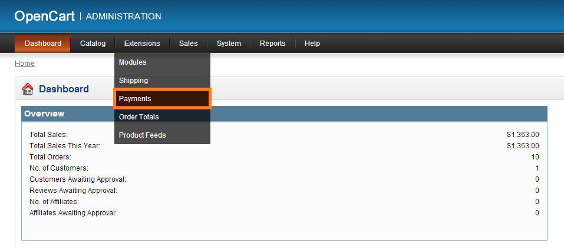
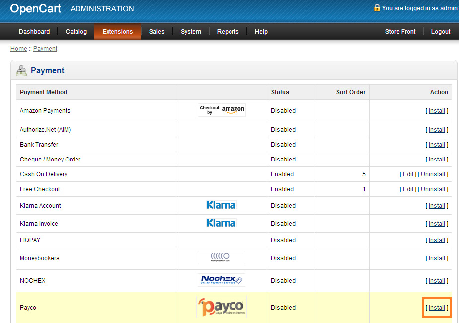
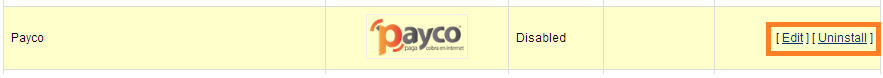
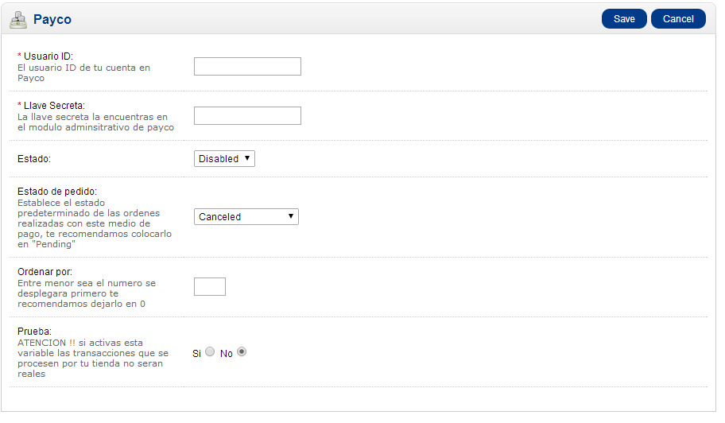

#ePayco plugin para OpenCart v2.2.x

**Si usted tiene alguna pregunta o problema, no dude en ponerse en contacto con nuestro soporte técnico: desarrollo@payco.co.**

## Tabla de contenido

* [Requisitos](#requisitos)
* [Instalación](#instalación)
* [Configuración](#configuración)
* [Pasos](#pasos)
* [Versiones](#versiones)

## Requisitos

* Tener una cuenta activa en [ePayco](https://pagaycobra.com).
* Tener instalado OpenCart v1.5.x o superior.
* Acceso a las carpetas donde se encuetra instalado OpenCart.

## Instalación

1. [Descarga el plugin.](https://github.com/epayco/Plugin_ePayco_OpenCart/releases)
2. Ubíquese en el directorio raíz del plugin, descomprimido y seleccione las carpetas que se encuentran en esa ubicación y cópielas en el directorio raíz del Open Cart, en caso de que le aparezca un mensaje sobre reemplazar carpetas, presione aceptar ya que es necesario sobrescribirlas, con esto ya está instalado el plugin, ahora pase al siguiente punto de configuración.

## Configuración

1. Para configurar el Plugin de ePayco, ingrese al administrador de open cart, ubique la sección **Extensions** en el menú principal, despliegue las opciones y haga clic sobre la opción **Payment**.
2. En la sección Payment encontrara una tabla con los métodos de pagos disponibles en el open cart entre ellos Payco, posiciónese sobre el y ubíquese en la columna Action de la tabla, haga clic en link Install, ahora el plugin se encuentra habilitado.
3. Ahora puede ver dos nuevos link presione el link Edit, para configurar el plugin.
4. Configure los siguientes campos:

	* **Usuario id**: Numero de usuario.
	* **Llave secreta**: Código asignado por ePayco.
	* **Estado**: yes (activara el medio de pago)
	* **Estado de pedido**: es el estado por defecto que se asignara aun pedido mientras se encuentra en proceso.
	* **Prueba**: Si (para realizar pruebas) o No (pasar a producción).

Luego de configurar los campos presione el botón **Save**. Y con esto quedara instalado, configurado y activado el método de pago para los clientes.

## Pasos

## Versiones
* [ePayco plugin OpenCart v1.5.x](https://github.com/epayco/Plugin_ePayco_OpenCart/releases/tag/1.5.x).
* [ePayco plugin OpenCart v2.1.x](https://github.com/epayco/Plugin_ePayco_OpenCart/releases/tag/2.1.x).
* [ePayco plugin OpenCart v2.2.x](https://github.com/epayco/Plugin_ePayco_OpenCart/releases/tag/2.2.x).
* [ePayco plugin OpenCart v2.3.0.3](https://github.com/epayco/Plugin_ePayco_OpenCart/releases/tag/2.3.0.3).
* [ePayco plugin OpenCart > v3.0](https://github.com/epayco/Plugin_ePayco_OpenCart/releases/tag/3.0).

